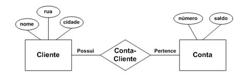

# Fundamentals
Um engenheiro de dados que está inciando deve ter uma base sólida em diversas áreas para ser eficaz em seu papel. Abaixo estão alguns items estritamente relevantes para se ter conhecimento/experiência :

### **Linguagens de Programação**
 Python e SQL é essencial. Python é frequentemente usado para ingestão e transformações e análises de dados, enquanto SQL é fundamental para consultas em bancos de dados e criações de dashboards.

### **Bancos de Dados**
Bancos de dados relacionais (MySQL, PostgreSQL) e não relacionais (como MongoDB, Cassandra). Saber como projetar, implementar e otimizar esquemas de banco de dados é crucial.

### **ETL (Extração, Transformação e Carga)**
Um processo de ETL, envolve a extração de dados de várias fontes(APIs, FTP/SFTP, Bancos de Dados, Scraping, etc), sua transformação(Normalizção dos dados e/ou adequação dos dados para se encaixarem na etapa seguinte) e a carga em um sistema de armazenamento.

### **Armazenamento de Dados** 
Atualmente um engenheiro de dados necessita lidar com diversos tipos de arquiteturas e modelos d bancos de dados. E com isso surgem as algumas arquiteturas para o armazenamento de dados :

- **Data Warehouse(Armazém de dados)**: É um sistema utilizado para armazenar e gerenciar grandes volumes de dados estruturados, que são organizados de forma a facilitar a análise e a geração de relatórios. Os dados são extraídos de várias fontes, transformados para garantir consistência e integridade, e carregados no armazém. Os Data Warehouses são otimizados para consultas complexas e análises de dados, geralmente utilizando um modelo de dados dimensional. Exemplo, Amazon Redshift.

- **Data Lake**: É um repositório que permite armazenar grandes volumes de dados em seu formato bruto(raw), sem a necessidade de estruturação prévia. Isso inclui dados estruturados, semiestruturados e não estruturados. Os Data Lakes são projetados para armazenar dados de forma escalável e econômica, permitindo que os usuários acessem e analisem os dados conforme necessário, utilizando ferramentas de análise e processamento de dados. Exemplo, Amazon S3; este comumente é utilizado como um Data Lake.

- **Delta Lake** É uma camada de armazenamento que traz confiabilidade e desempenho para Data Lakes. Ele permite transações ACID (Atomicidade, Consistência, Isolamento e Durabilidade) em dados armazenados em um Data Lake, o que significa que as operações de leitura e gravação são seguras e consistentes. O Delta Lake também suporta versionamento de dados, o que facilita a auditoria e a recuperação de dados. Exemplo, Databricks.

- **Lake House ou Data Lake House**: É frequentemente usado de forma intercambiável com Lake House, referindo-se a uma arquitetura que combina elementos de Data Lakes e Data Warehouses. Ele permite que os dados sejam armazenados em um formato bruto (como em um Data Lake), mas também oferece funcionalidades de gerenciamento e otimização de dados típicas de um Data Warehouse. Isso permite que as organizações aproveitem a flexibilidade dos Data Lakes, enquanto ainda têm acesso a análises e relatórios eficientes. Exemplo, Google BigLake.

###  **Processamento de Dados**
Estar preparado para o processamento de pouco ou um grande volume de dados é realmente necessário. Dentre isso, saber otimizar o tempo, recursos e dinheiro para que a tarefa seja executada é uma boa prática. Ferrametas de processamento de dados em lote e em tempo real: Apache Spark, Apache Kafka ou Apache Flink.

### **Modelagem de Dados**
Compreensão dos conceitos de modelagem de dados, incluindo normalização, desnormalização e design de esquemas. Tipos de Modelagem de Dados :

- **Modelagem Conceitual**: é uma representação abstrata e de alto nível da estrutura de dados de um sistema. Ele é utilizado para capturar e descrever os requisitos de dados de uma organização de forma que seja compreensível para as partes interessadas, como analistas de negócios e usuários finais. O objetivo principal do modelo conceitual é fornecer uma visão clara e concisa dos dados que serão armazenados, sem se preocupar com detalhes técnicos ou de implementação.

    - Modelo Entidade-Relacionamento: é o método utilizado para realizar a representação abstrata.

        

- **Modelagem Lógica**: é uma etapa do processo que se concentra na estruturação e organização dos dados de forma mais detalhada, após a modelagem conceitual. Enquanto a modelagem conceitual captura os requisitos de alto nível e as relações entre entidades, a modelagem lógica refina essas informações e as traduz em um formato que pode ser implementado em um sistema de gerenciamento de banco de dados (SGBD).

    - Diagrama Entidade-Relacionamento: é o método utilizado para uma profundidade maior no detalhamento do banco de dados à partir do modelo conceitual.

        
        fonte: [O que é um diagrama entidade relacionamento?](https://www.lucidchart.com/pages/pt/o-que-e-diagrama-entidade-relacionamento)

- **Modelagem Física**: Envolve a implementação do modelo lógico em um sistema de gerenciamento de banco de dados específico. Isso inclui a definição de tabelas, índices, partições e outros aspectos técnicos que afetam o desempenho e a eficiência do banco de dados.

### **Ferramentas de Visualização de Dados**
Conhecimento em ferramentas de visualização como Tableau, Power BI ou Looker pode ser um diferencial.

### **Fundamentos de Big Data**
Noções básicas sobre tecnologias de Big Data e suas arquiteturas, como Hadoop e suas ferramentas associadas.

### **Versionamento de Código**
Familiaridade com sistemas de controle de versão, como Git, para gerenciar alterações no código.

**Práticas de DevOps**: Entendimento básico de práticas de DevOps e integração contínua/entrega contínua (CI/CD) pode ser útil.

**Segurança de Dados**: Noções sobre segurança de dados e privacidade, incluindo práticas de proteção de dados sensíveis.

**Soft Skills**: Habilidades de comunicação e trabalho em equipe são essenciais, pois engenheiros de dados frequentemente colaboram com outras equipes, como analistas de dados e cientistas de dados.